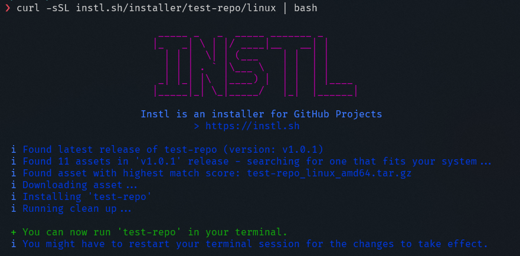

# 👋 Welcome


Instl is an installation script generator for GitHub projects. It does not need any setup, and can be used to install most GitHub projects on Linux, macOS and Windows.

You can easily add installation commands to your project readme - they just work!.


## Usage


INSTL can be used via a simple command. The command will query our API-Server to create an installation script for a specific project, and execute the script. No need to install anything before!


See more in our "Getting Started" guide!


[getting-started.md](usage/getting-started.md)


## Statistics


INSTL features statistics to see the installation count of various projects.


More about viewing the statistics in the "STATISTICS" section.


[Broken link](broken-reference)


## API


INSTL features an API to create installation scripts and query the installation count of projects.


See more in the "API" section.


[Broken link](broken-reference)

